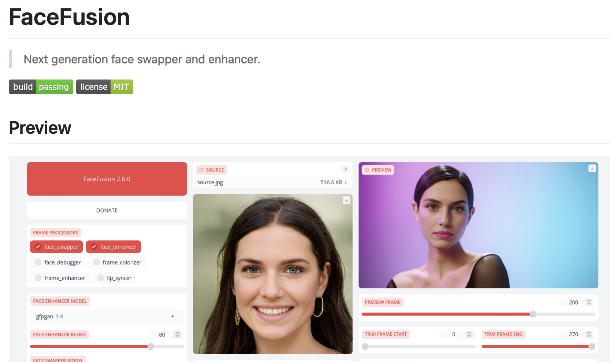

# 🌀 ControlNeXt-SVD

This is our implementation of ControlNeXt based on [Stable Video Diffusion](https://huggingface.co/stabilityai/stable-video-diffusion-img2vid-xt-1-1). It can be seen as an attempt to replicate the implementation of [AnimateAnyone](https://github.com/HumanAIGC/AnimateAnyone) with a more concise and efficient architecture.

Compared to image generation, video generation poses significantly greater challenges. While direct training of the generation model using our method is feasible, we also employ various engineering strategies to enhance performance. Although they are irrespective of academic algorithms.


> Please refer to [Examples](#examples) for further intuitive details.\
> Please refer to [Base model](#base-model) for more details of our used base model. \
> Please refer to [Inference](#inference) for more details regarding installation and inference.\
> Please refer to [Advanced Performance](#advanced-performance) for more details to achieve a better performance.\

# Examples
If you can't load the videos, you can also directly download them from [here](outputs).

<video width="80%" height='auto' style="display: block; margin: 20px auto;" controls autoplay loop src="https://github.com/dvlab-research/ControlNeXt/assets/22709028/c0ec7591-2100-42d9-99dd-cc55c5fa006f" muted="false"></video>

<video width="80%" height='auto' style="display: block; margin: 20px auto;" controls autoplay loop src="https://github.com/dvlab-research/ControlNeXt/assets/22709028/5da1ba44-cb92-49c2-95f4-05b8e02ed6eb" muted="false"></video>

<video width="40%" height='auto' style="display: block; margin: 20px auto;" controls autoplay loop src="https://github.com/dvlab-research/ControlNeXt/assets/22709028/bc819ca7-81f3-4d63-901a-a1a4b4afc395" muted="false"></video>

<video width="40%" height='auto' style="display: block; margin: 20px auto;" controls autoplay loop src="https://github.com/dvlab-research/ControlNeXt/assets/22709028/adc01423-fcec-467e-a7ab-87a6e1ef5f62" muted="false"></video>

# Base Model

The base model's generation capability significantly influences video generation. Initially, we train the generation model using our method, which is based on [Stable Video Diffusion XT-1.1](https://huggingface.co/stabilityai/stable-video-diffusion-img2vid-xt-1-1). However, the original SVD model exhibits weaknesses in generating human features, particularly in the generation of hands and faces.

Therefore, we initially conduct continuous pretraining of [SVD-XT1.1](https://huggingface.co/stabilityai/stable-video-diffusion-img2vid-xt-1-1) on our curated collection of human-related videos to improve its ability to generate human features. Subsequently, we fine-tune it for specific downstream tasks, i.e., generating dance videos guided by pose sequences.

In this project, we release all our models including the base mode and the fine-tuned model. You can download them from:
* [Fintuned Model](https://huggingface.co/Pbihao/ControlNeXt/tree/main/ControlNeXt-SVD/finetune): We fine-tune our own trained base model for the downstream task using our proposed method, incorporating only `50M` learnable parameters. For your convenience, we directly merge the pretrained base model with the fine-tuned parameters, and you can download this consolidated model.
* [Continuously Pretrained Model](https://huggingface.co/Pbihao/ControlNeXt/tree/main/ControlNeXt-SVD/pretrained): We continuously pretrain the base model using our collected human-related data, based on [SVD-XT1.1](https://huggingface.co/stabilityai/stable-video-diffusion-img2vid-xt-1-1). This approach improves performance in generating human features, particularly for hands and faces. However, due to the complexity of human motion, it still faces challenges similar to SVD in preferring to generate static videos. Nonetheless, it excels in downstream tasks. We encourage more participation to further enhance the base model for generating human-related videos.
* [Fintuned Parameters](https://huggingface.co/Pbihao/ControlNeXt/tree/main/ControlNeXt-SVD/learned_params): The parameters involved in the fine-tuning process. Or you can directly download `Fintuned Model`.


# Inference

1. Clone our repository
2. `cd ControlNeXt-SVD`
3. Download the pretrained weight into `pretrained/` from [here](https://huggingface.co/Pbihao/ControlNeXt/tree/main/ControlNeXt-SVD/finetune). (More details please refer to [Base Model](#base-model))
4. Run the scipt

```python
python run_controlnext.py \
  --pretrained_model_name_or_path stabilityai/stable-video-diffusion-img2vid-xt-1-1 \
  --validation_control_video_path examples/pose/pose.mp4 \
  --output_dir outputs/tiktok \
  --controlnext_path pretrained/controlnet.bin \
  --unet_path pretrained/unet_fp16.bin \
  --ref_image_path examples/ref_imgs/tiktok.png
```

> --pretrained_model_name_or_path : pretrained base model, we pretrain and fintune models based on [SVD-XT1.1](https://huggingface.co/stabilityai/stable-video-diffusion-img2vid-xt-1-1)\
> --controlnet_model_name_or_path : the model path of controlnet (a light weight module) \
> --unet_model_name_or_path : the model path of unet 

> 📌 If your want to get better generated video, please refer to [Advanced Performance](#advanced-performance) for more details.


# Advanced Performance
In this section, we will delve into additional details and my own experiences to enhance video generation. These factors are algorithm-independent and unrelated to academia, yet crucial for achieving superior results. Many closely related works incorporate these strategies.

### Reference Image

It is crucial to ensure that the reference image is clear and easily understandable, especially aligning the face of the reference with the pose.


### Face Enhencement

Most related works utilize face enhancement as part of the post-processing. This is especially relevant when generating videos based on images of unfamiliar individuals, such as friends, who were not included in the base model's pretraining and are therefore unseen and OOD data.

We recommand the [Facefusion](https://github.com/facefusion/facefusion
) for the post proct-processing. And please let us know if you have a better solution.

Please refer to [Facefusion](https://github.com/facefusion/facefusion
) for more details.




### Continuously Finetune

To significantly enhance performance on a specific pose sequence, you can continuously fine-tune the model for just a few hundred steps. 

We will release the related fine-tuning code later.

### Pose Generation

We adopt [DWPose](https://github.com/IDEA-Research/DWPose) for the pose generation.

# Limitations

## IP Consistency

We did not prioritize maintaining IP consistency during the development of the generation model and now rely on a helper model for face enhancement. 

However, additional training can be implemented to ensure IP consistency moving forward.

This also leaves a possible direction for futher improvement.

## Base model

The base model plays a crucial role in generating human features, particularly hands and faces. We encourage collaboration to improve the base model for enhanced human-related video generation.

# TODO

* Training and finetune code
